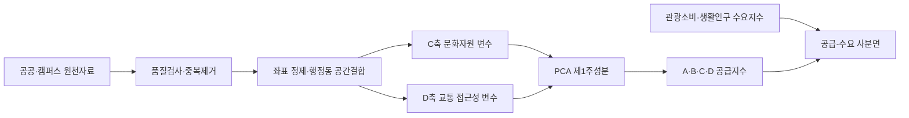

# Seoul Tourism Experience Index

[](https://github.com/chan12-photo/seoul-tourism-experience-index/actions/workflows/ci.yml)

서울시 426개 행정동의 관광 공급과 외국인 관광수요를 비교해, 수요에 비해 관광 경험 기반이 부족한 지역을 찾은 팀 프로젝트입니다. 이 저장소는 프로젝트 전체 중 **문화자원(C축)과 교통 접근성(D축) 데이터 파이프라인**을 공개 가능한 형태로 재구성한 포트폴리오 버전입니다.

## 핵심 질문

> 외국인 방문과 소비는 활발하지만, 음식·상권·문화·교통 기반이 상대적으로 부족한 서울의 행정동은 어디인가?

공급지수 `X`는 음식(A), 상권(B), 문화(C), 교통(D) 네 축으로 구성하고, 수요지수 `Y`는 외국인 관광소비(Y1)와 단기체류 외국인 생활인구(Y2)를 결합했습니다. 행정동별 공급과 수요를 사분면으로 나눠 정책 검토가 필요한 지역을 선별했습니다.

## 프로젝트 결과

| 항목 | 결과 |
|---|---:|
| 분석 단위 | 서울시 426개 행정동 |
| 공급지수와 수요지수의 Pearson 상관계수 | 0.6760 |
| 유의확률 | 3.51e-58 |
| 수요 대비 공급이 낮은 4사분면 지역 | 49개 |
| 대표 검토 지역 | 중앙동, 우이동, 상일2동 |

상관관계는 지수의 방향성을 뒷받침하지만 인과관계를 의미하지 않습니다. 4사분면 결과도 정책 확정 목록이 아니라 현장조사와 추가 검증을 위한 후보군입니다.

## 담당 범위

박찬일은 팀 프로젝트에서 다음 업무를 담당했습니다.

- 문화자원 C축과 교통 접근성 D축 변수 설계 및 데이터 수집
- 서울 빅데이터캠퍼스 방문과 분석용 데이터 확보
- 행정동 단위 공간결합, 관광지 지오코딩, 문화유산 선별 파이프라인 구현
- 보고서의 C/D축 방법론, 2·4사분면 해석, 정책 제안과 연구 한계 작성

전체 TEI 설계, A/B축, 관광수요 Y축과 모든 PCA 분석을 단독 수행한 프로젝트가 아닙니다. 자세한 역할 경계는 [기여 범위](docs/contribution.md)에 기록했습니다.

## 데이터 흐름



## 정리된 변수명

초기 코드의 `D3=거점거리`, `D4=버스정류장`을 최종보고서 기준으로 통일했습니다.

| 축 | 최종 변수 | 의미 |
|---|---|---|
| C | C1 | 문화공간 수 |
| C | C2 | 관광지 수, 최종 C축 PCA에서는 제외 |
| C | C3 | 전통·역사, 문화·예술, 자연·힐링, 현대·한류·라이프스타일 콘텐츠 수 |
| C | C4 | 관광지 콘텐츠 분류 완료율 |
| C | C5 | 장소형 문화유산 수의 `log1p` 변환값 |
| D | D1 | 지하철역 수 |
| D | D2 | 4개 주요 거점 중 최근접 거점까지의 직선거리, PCA에서는 부호 반전 |
| D | D3 | 버스정류장 수 |

`D2`는 대중교통 이동시간이 아닙니다. 명동역·홍대입구역·강남역·서울역까지의 Haversine 직선거리 중 최솟값을 사용한 접근성 대리변수입니다.

## 실행

Python 3.11 이상이 필요합니다.

```bash
python -m venv .venv
source .venv/bin/activate
python -m pip install -e ".[dev]"
python -m pytest
tei-pipeline check-public .
```

공간결합까지 실행하려면 다음 선택 의존성을 설치합니다.

```bash
python -m pip install -e ".[geo,dev]"
```

가장 가까운 관광거점 계산 예시는 다음과 같습니다.

```bash
tei-pipeline nearest-hub \
  --origins data/interim/administrative_dong_centroids.csv \
  --hubs data/raw/hub_points.csv \
  --passthrough district administrative_dong \
  --output data/processed/d2_nearest_hub.csv
```

PCA 축 점수 계산 시 `zscore`가 기본값입니다. 원 연구의 결합 방식을 재현해야 할 때만 `--score-scale none`을 지정합니다.

```bash
tei-pipeline pca-axis \
  --input data/processed/c_axis_features.csv \
  --features C1_culture_space_count C3_traditional_count C3_art_count \
             C3_nature_count C3_modern_count C4_classification_completion_ratio \
             C5_heritage_log_count \
  --output-column C_axis_PC1 \
  --output data/processed/c_axis_pca.csv
```

## 저장소 구조

```text
src/tei_pipeline/       재사용 가능한 전처리·지표·PCA 코드
tests/                  공개 데이터가 필요 없는 합성데이터 테스트
docs/                   방법론, 데이터 사전, 역할, 재현성과 공개 정책
data/                   로컬 데이터 배치 위치, 실제 데이터는 Git 제외
artifacts/              공개 승인된 그림과 결과물 배치 위치
```

## 공개 범위

원본 압축파일의 API 키, 빅데이터캠퍼스 원천·중간 데이터, 대용량 공간파일, 팀원 개인정보가 포함된 보고서와 발표자료는 이 저장소에 포함하지 않습니다. API 키는 원본에서 삭제하는 것만으로 충분하지 않으며 기존 키를 폐기하고 재발급해야 합니다.

데이터를 추가하기 전 [데이터 공개 정책](docs/data-governance.md)과 [공개 전 체크리스트](docs/publication-checklist.md)를 확인해야 합니다. 현재 저장소에는 제3자 데이터 재배포 권한이 확인되지 않았으므로 코드와 방법론만 공개합니다.

## 문서

- [분석 방법론](docs/methodology.md)
- [데이터 사전](docs/data-dictionary.md)
- [재현 방법](docs/reproducibility.md)
- [기여 범위](docs/contribution.md)
- [원본 스크립트 대응표](docs/source-script-map.md)
- [연구 한계](docs/limitations.md)
