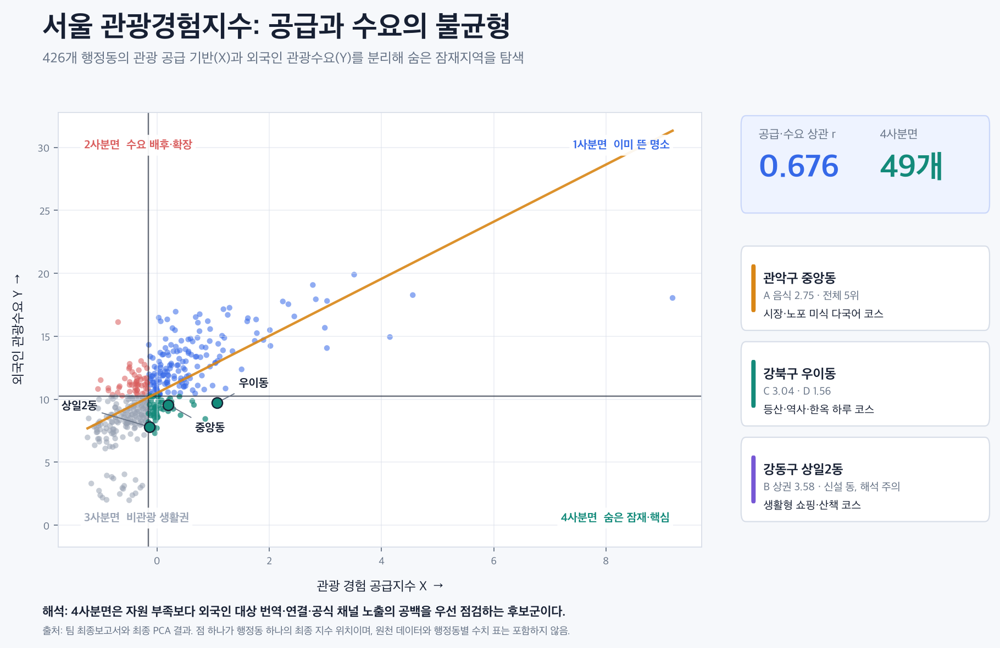
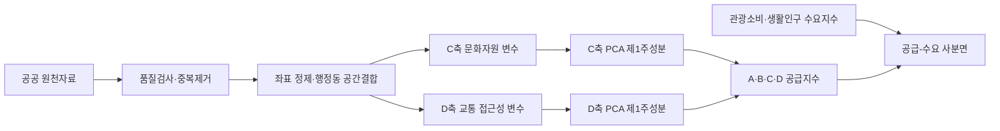
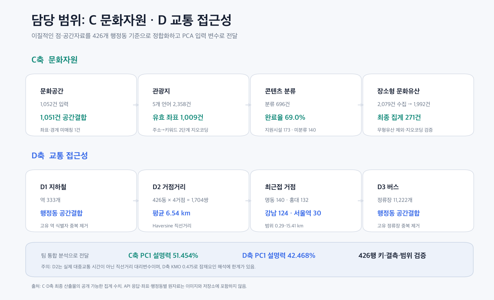

# 서울 관광경험지수: 관광 기반은 있는데 외국인이 찾지 않는 동네 찾기

[](https://github.com/chan12-photo/seoul-tourism-experience-index/actions/workflows/ci.yml)

서울 426개 행정동의 관광 공급(음식·상권·문화·교통)과 외국인 관광수요를 따로 지수화해 비교했습니다. 관광 기반은 갖췄지만 외국인에게 충분히 알려지지 않은 지역을 찾는 것이 목표입니다. 성균관대 데이터마이닝실습 3인 팀 프로젝트(2026년 1학기)이며, 이 저장소는 그중 제가 맡은 **문화자원(C축)과 교통 접근성(D축) 데이터 파이프라인**을 공개용으로 다시 구현한 것입니다.

`Python` `pandas` `GeoPandas` `NumPy(PCA)` `Kakao Local API` `pytest` `Ruff` `GitHub Actions`

- **4사분면 49개 행정동**: 공급은 중앙값 이상인데 외국인 수요는 중앙값 미만인 지역입니다. 대표 후보로 관악구 중앙동, 강북구 우이동, 강동구 상일2동을 골랐습니다.
- **공급지수와 수요지수의 상관계수 r = 0.676**: 공급 기반이 좋은 동네일수록 외국인 수요도 높았습니다. 그 추세에서 벗어난 지역이 정책 검토 대상입니다.
- **제가 맡은 부분**: 흩어져 있던 공공 점 데이터를 426개 행정동 단위로 맞췄습니다.
  - 문화공간 1,051곳, 관광지 1,009곳, 문화유산 271곳, 지하철역 333곳, 버스정류장 11,222곳
  - 관광지와 문화유산 좌표는 Kakao API로 지오코딩했습니다.



## 제 역할

팀은 백서윤(팀장, 전체 지수 설계·A/B축), 김동혁(Y축·PCA와 검정), 저 세 명이었습니다. 저는 다음을 맡았습니다.

- C축(문화자원)·D축(교통 접근성)의 변수 설계와 데이터 수집
  - 관광지 2,358건을 주소와 키워드 2단계로 지오코딩하고, 보수적인 기준으로 유효 좌표 1,009건을 골랐습니다.
  - 문화유산 2,079건 중 무형유산과 소장품형 항목을 걸러 장소형 271건을 남겼습니다.
  - 관광 콘텐츠를 네 유형(전통·역사, 문화·예술, 자연·힐링, 현대·한류)으로 분류했습니다.
- 행정동 단위 공간결합과 각 단계의 건수 검증
- 최종 보고서의 C·D축 방법론, 2·4사분면 해석, 정책 제안, 연구 한계 작성
- 이 저장소: 일회성 스크립트 26개를 테스트가 있는 모듈과 CLI로 다시 구현했습니다.

역할 경계는 [기여 범위](docs/contribution.md)에 자세히 적었습니다.

## 결과

| 항목 | 결과 |
|---|---:|
| 분석 단위 | 서울 426개 행정동 |
| 공급지수(X)와 수요지수(Y)의 Pearson 상관계수 | 0.676 |
| 4사분면(공급 높음·수요 낮음) 행정동 | 49개 |
| 축 가중치를 ±20% 바꿨을 때 공급지수 순위의 Spearman 상관 (8개 시나리오) | 평균 0.996, 최소 0.993 |
| 축별 PCA 제1주성분 설명력 | A 39.7% · B 39.8% · C 51.5% · D 42.5% |

- **4사분면 후보는 정책 확정 목록이 아닙니다.** 현장 확인이 필요한 후보군입니다. 신설 동인 상일2동은 과거 강일동 값을 면적 비율로 나눠 받은 영향이 있어, B축(상권) 점수를 그대로 믿기 어렵습니다.
- **2사분면(공급 낮음·수요 높음)의 북아현동**은 자체 관광자원보다 인접한 신촌·이대 상권 수요가 넘어온 사례로 해석했습니다.

## 지수 구성


```mermaid
flowchart LR
    R[공공 원천자료] --> Q[품질검사·중복제거]
    Q --> G[좌표 정제·행정동 공간결합]
    G --> C[C축 문화자원 변수]
    G --> D[D축 교통 접근성 변수]
    C --> CP[C축 PCA 제1주성분]
    D --> DP[D축 PCA 제1주성분]
    CP --> X[A·B·C·D 공급지수]
    DP --> X
    Y[관광소비·생활인구 수요지수] --> M[공급-수요 사분면]
    X --> M
```

- **공급지수 X**: 음식(A)·상권(B)·문화(C)·교통(D) 네 축에 각각 PCA를 적용하고, 제1주성분을 같은 가중치로 평균했습니다.
- **수요지수 Y**: 외국인 관광지출액(한국관광공사 데이터랩, 2025년 6월~2026년 5월)과 단기체류 외국인 생활인구(2025년 1~6월, 로그 변환)를 1~20 척도로 맞춘 뒤 평균했습니다.



| 축 | 변수 | 의미 |
|---|---|---|
| C | C1 | 문화공간 수 |
| C | C2 | 관광지 수. C3·C4와 계산식이 겹쳐 최종 PCA에서 제외 |
| C | C3 | 전통·역사, 문화·예술, 자연·힐링, 현대·한류 유형별 관광지 수 |
| C | C4 | 관광지 콘텐츠 분류 완료율 |
| C | C5 | 장소형 문화유산 수의 `log1p` 변환값 |
| D | D1 | 지하철역 수 |
| D | D2 | 명동·홍대입구·강남·서울역 중 가장 가까운 곳까지의 직선거리. PCA에서는 부호를 반전 |
| D | D3 | 버스정류장 수 |

D2는 대중교통 이동시간이 아니라 직선거리로 대신한 지표입니다. TMAP 이동시간 API는 호출량 제한 때문에 끝까지 수집하지 못했습니다.

## 한계

- **D축의 한계(제가 맡은 축)**: D축은 KMO 0.475, Cronbach's alpha 0.04로, 세 변수를 하나의 잠재요인으로 묶기에는 약합니다. 거리 지표(D2)도 실제 이동시간이 아닙니다. 다음에 다시 한다면 대중교통 이동시간 데이터(GTFS 등)로 접근성을 측정하겠습니다.
- **상관계수의 유의성**: 인접 행정동끼리 값이 비슷한 공간 자기상관을 검정하지 않았습니다. 그래서 상관계수의 유의확률을 결과로 내세우지 않습니다.
- **외부 검증 없음**: 정답 레이블이나 외부 지표로 지수를 검증하지 않았습니다.
- 자세한 내용은 [연구 한계](docs/limitations.md)에 있습니다.

## 실행

Python 3.11 이상이 필요합니다.

```bash
python -m venv .venv
source .venv/bin/activate
make install
make verify
```

`make verify`와 GitHub Actions는 같은 검사를 실행합니다.
- 합성 데이터 단위 테스트와 GeoPandas 공간결합 통합 테스트
- Ruff 린트와 포맷 검사
- 의존성 무결성 검사
- 비밀정보·원천 데이터 공개 차단 검사

예를 들어 가장 가까운 관광거점은 이렇게 계산합니다.

```bash
tei-pipeline nearest-hub \
  --origins data/interim/administrative_dong_centroids.csv \
  --hubs data/raw/hub_points.csv \
  --passthrough district administrative_dong \
  --output data/processed/d2_nearest_hub.csv
```

PCA 축 점수는 기본으로 z-score로 다시 표준화한 뒤 결합합니다. 원 연구 방식(추가 표준화 없음)을 재현할 때는 `--score-scale none`을 지정합니다.

## 데이터와 재현 범위

원천 데이터는 모두 공공데이터입니다. 하지만 데이터셋별 이용 조건과 Kakao 지오코딩 결과의 재배포 조건을 아직 정리하지 않아 저장소에 넣지 않았습니다. 그래서 CI는 합성 데이터로 함수와 검증 규칙을 테스트합니다. 이 저장소만으로 426개 행정동의 최종 지수를 처음부터 다시 만들 수는 없습니다.

그림은 로컬의 최종 산출물이 보고서 수치(행 수, 상관계수, 사분면별 행정동 수, 대표 지역 점수)와 일치할 때만 다시 생성되도록 했습니다. 데이터 출처는 [data/README.md](data/README.md)에, 재현 방법은 [재현 방법](docs/reproducibility.md)에 적었습니다.

```text
src/tei_pipeline/       전처리·지표·PCA 모듈과 CLI
tests/                  합성 데이터 테스트
scripts/                포트폴리오 그림 생성과 집계값 검증
docs/                   방법론, 데이터 사전, 역할, 재현 방법, 한계
assets/                 집계 결과 그림
```

## 문서

- [분석 방법론](docs/methodology.md)
- [데이터 사전](docs/data-dictionary.md)
- [기여 범위](docs/contribution.md)
- [원본 스크립트 대응표](docs/source-script-map.md)
- [연구 한계](docs/limitations.md)
- [재현 방법](docs/reproducibility.md)
- [데이터 공개 정책](docs/data-governance.md)
- [저작권·재사용 고지](NOTICE.md)
